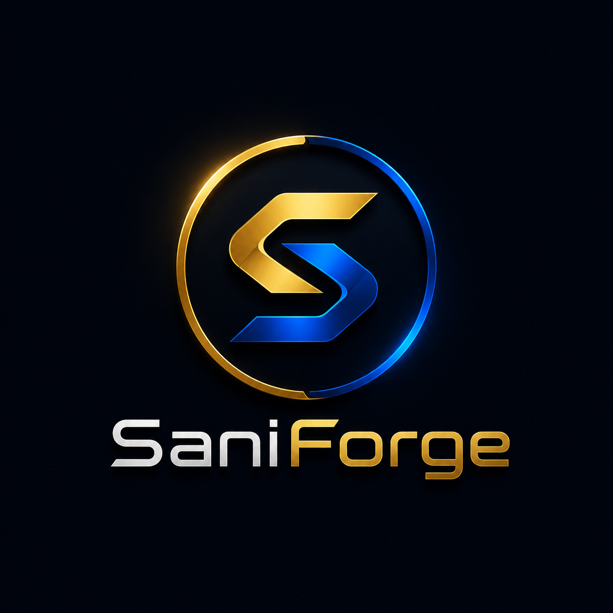

  

<h1 align="center">SaniForge</h1>

  Websites, words &amp; automated systems for businesses that want to scale faster.

  

## About

Personal portfolio site for **Abdul Kalyum Sani** — web developer, SEO copywriter, and automation engineer at [GrowMinion](https://growminion.com/). Built with Next.js (App Router), TypeScript, and Tailwind CSS, with MDX-powered blog and case study content.

## Features

- Home, About, Skills, Blog, and case-study sections
- MDX blog & work content with reading time, related posts, and table of contents
- Contact form, WhatsApp/booking links, and social integrations (LinkedIn, Facebook, GrowMinion)
- SEO metadata, sitemap, and JSON-LD structured data

## Tech Stack

Next.js · TypeScript · Tailwind CSS · MDX · Framer Motion · Lucide Icons

## Links

- Live site: [saniforge.com](https://saniforge.com)
- GrowMinion: [growminion.com](https://growminion.com/)
- LinkedIn: [linkedin.com/in/sani48](https://www.linkedin.com/in/sani48)
- Facebook: [facebook.com/abdulkaiyum.sani.50](https://www.facebook.com/abdulkaiyum.sani.50)
